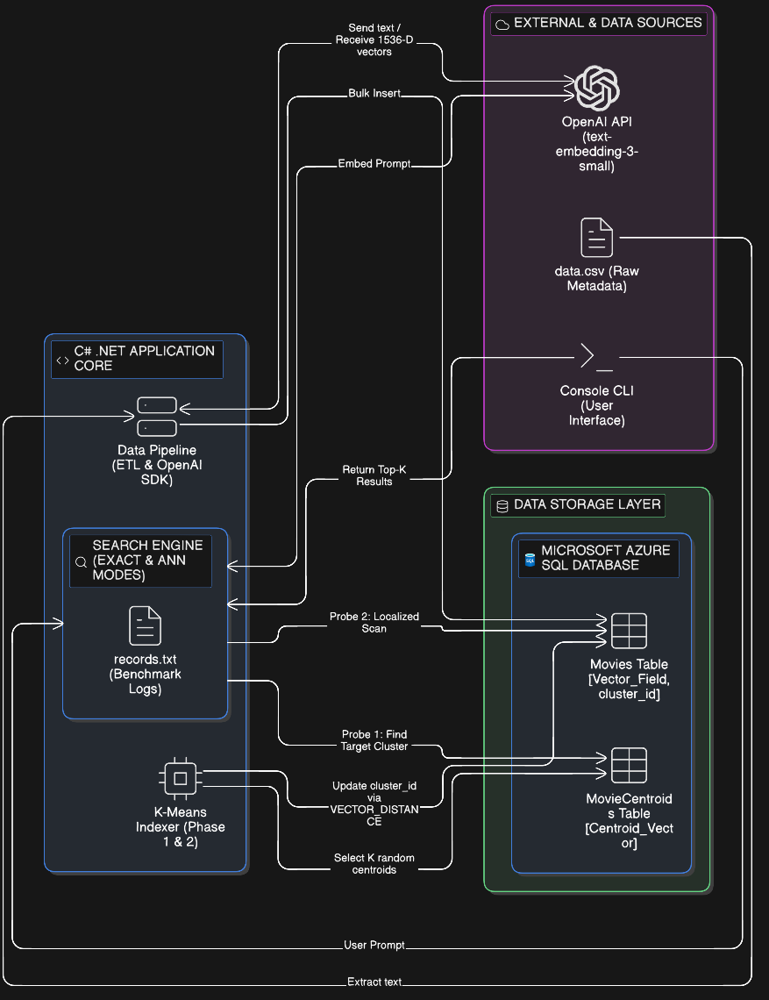
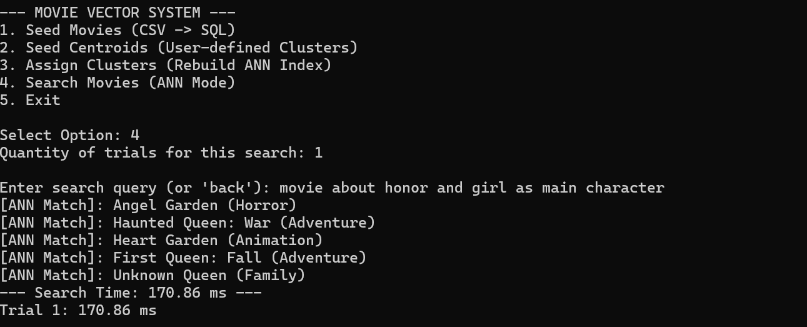
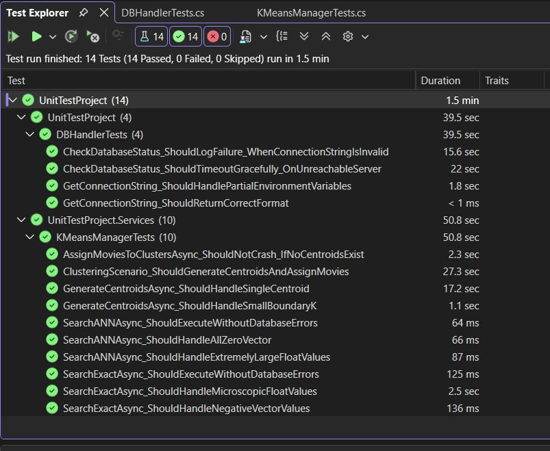

# C# Vector Search & ANN Indexing

An Approximate Nearest Neighbor (ANN) search and indexing engine implemented in C# (.NET 9) leveraging SQL Server Native Vector Search and OpenAI embeddings. The system decouples semantic query latency from dataset scale by implementing a K-Means Inverted File (IVF) index directly at the database layer.

## 📌 Technical Overview

Brute-force k-Nearest Neighbor ($k$-NN) vector search calculates geometric distances across every row in a database, resulting in an exhaustive $O(N)$ search complexity. While exact search guarantees 100% recall, it becomes computationally prohibitive on large-scale datasets.

This system resolves that bottleneck by constructing an **Inverted File (IVF) indexing pipeline** using **K-Means Clustering**:

- **High-Dimensional Embeddings:** Ingests raw text and converts it into 1,536-dimensional floating-point vectors via OpenAI's `text-embedding-3-small` model.
- **Space Partitioning:** Groups vectors into $K$ semantic clusters, each anchored by a reference centroid.
- **Two-Probe Search ($O(\sqrt{N})$):** Prunes up to 98% of the search space by identifying the closest centroid before executing localized similarity matching.

## 🏗 System Architecture



The application follows a clean three-tier architectural model separating external services, core orchestration, and database persistence:

1. **External & Ingestion Layer:**
   - **OpenAI API (`text-embedding-3-small`):** Generates 1,536-dimensional semantic embeddings for raw movie metadata and real-time user queries.
   - **Local Metadata Source:** CSV dataset utilized for bulk extraction and ingestion benchmarking.
   - **Interactive CLI:** Terminal-based orchestration layer displaying system telemetry, cluster metrics, and live query execution.

2. **C# .NET Application Core:**
   - **ETL Pipeline:** Handles batch parsing, API vectorization, and bulk SQL insertions.
   - **K-Means Indexer:** Partitions the vector space into discrete Voronoi cells, assigning records via Euclidean distance calculations.
   - **Dual Search Engine:** Provides both Exact $k$-NN (brute force) and ANN (two-probe) execution pathways alongside an automated benchmark logger.

3. **Data Persistence Layer (SQL Server / Azure SQL):**
   - **`Movies` Table:** Stores raw metadata, 1,536-D vectors (`VECTOR(1536)`), and assigned cluster foreign keys (`cluster_id`).
   - **`MovieCentroids` Table:** Stores the anchor vectors representing the centroid coordinates for each cluster
   - **Transact-SQL Execution:** Uses native vector distance functions (`VECTOR_DISTANCE`) to execute distance calculations directly inside the relational database engine.

## 📂 Repository Structure

```text
ANNIndexingSln/
├── ANNIndexingSample/             # Primary Application Project
│   ├── Database/                  # Connection pooling and raw SQL execution
│   ├── Data/                      # Local data sources for seeding
│   ├── Entities/                  # Schema models (Movie, Centroid)
│   ├── Helper/                    # Telemetry logging and diagnostic timers
│   ├── Properties/                # Configuration and environment templates
│   ├── Services/                  # K-Means clustering, indexing & search services
│   └── Program.cs                 # CLI entry point and orchestration workflow
├── UnitTestProject/               # Automated Test Suite (14 Tests)
│   ├── DBHandlerTests.cs          # Connection resiliency & timeout assertions
│   └── KMeansManagerTests.cs      # Clustering logic & vector math validation
├── Documentation/                 # Architectural diagrams and telemetry assets
└── ANNIndexingSln.sln             # Visual Studio / Rider Solution file
```

## 🔍 Interactive CLI & Semantic Search

The engine features an interactive command-line interface for database lifecycle operations, hyperparameter configuration, and query benchmarking.



### Search Mechanics:

1. **Probe 1 (Centroid Match):** The incoming query vector is compared against the $K$ centroid vectors in `MovieCentroids` using Euclidean distance to identify the nearest semantic partition:
   $$d(\mathbf{u}, \mathbf{v}) = \sqrt{\sum_{i=1}^{n} (u_i - v_i)^2}$$
2. **Probe 2 (Neighborhood Scan):** Query execution is filtered using `WHERE cluster_id = @TargetCluster`, scanning only within that specific localized partition to retrieve the top semantic matches.
3. **Exact Mode Baseline:** Calculates Euclidean distance against all 30,000 vectors without clustering filters, used strictly to benchmark latency and verify recall accuracy.

## 📊 Empirical Benchmarks (30,000 Vectors & 1,536 Dimensions)

Benchmarking was conducted across 1,000 automated query trials executed against an Azure SQL database instance utilizing native Transact-SQL vector operations:

| Metric / Mode          | Exact k-NN Search               | ANN IVF Index Search                 | Performance Delta            |
| :--------------------- | :------------------------------ | :----------------------------------- | :--------------------------- |
| **Search Space**       | 30,000 records (100% full scan) | Single cluster partition (~2% - 10%) | **Up to 98% scan reduction** |
| **Mean Query Latency** | ~210 ms                         | **~141 ms – 160 ms**                 | **~30% faster execution**    |
| **Time Complexity**    | $O(N)$                          | **$O(\sqrt{N})$**                    | **Sub-linear scaling**       |

### Hyperparameter Analysis ($K$ Tuning):

- $K = 10$: Fast initial probe, but larger partition sizes increase Phase 2 neighborhood scan time (~150 ms mean).
- $K = 100$: Intermediate cluster balance; higher combined overhead of centroid matching and scan verification (~190 ms mean).
- $K = 1000$: Centroid probing overhead is compensated by microscopic cluster partitions (~30 vectors/cluster), pulling latency down to ~165 ms.

## 🧪Testing



The solution includes an isolated test suite (UnitTestProject) to assert system stability across network disruptions and mathematical edge cases:

- Database Layer (4 Tests): Validates connection string construction from environment variables and asserts graceful timeouts during unreachable server states.
- Algorithmic Integrity (10 Tests): Tests boundary conditions for cluster counts ($K$), empty centroid states, and asserts that vector distance calculations gracefully handle anomalous inputs (all-zero vectors, microscopic floats, extreme float magnitudes).

```bash
# Execute the automated test suite
dotnet test UnitTestProject/UnitTestProject.csproj
```

(All 14 test cases pass in ~1.5 min)

## ⚙️ Environment Setup

### Prerequisites

Before running the application, ensure you have the following installed:

- **[.NET 9.0 SDK](https://dotnet.microsoft.com/download)**
- **Microsoft Azure SQL Database** (Must support native `VECTOR` types)
- **OpenAI API Key** (With access to `text-embedding-3-small`)

### 1. Clone the Repository

```bash
git clone
cd
```

### 2. Build and Run the Application

Create a file named launchSettings.json inside the ANNIndexingSample/Properties/ directory and configure your credentials:

```json
{
  "profiles": {
    "ANNIndexingSample": {
      "commandName": "Project",
      "environmentVariables": {
        "OPENAI_API_KEY": "your-openai-api-key",
        "DB_SERVER": "tcp:your-server.database.windows.net,1433",
        "DB_NAME": "embeddingdb",
        "DB_USER": "your-sql-username",
        "DB_PASSWORD": "your-sql-password",
        "TABLE_MOVIES": "Movies",
        "TABLE_CENTROIDS": "MovieCentroids"
      }
    }
  }
}
```

Once your environment variables are set, restore the dependencies and run the console application:

```bash
# Navigate to the project directory
cd ANNIndexingSample

# Restore dependencies
dotnet restore

# Build the project
dotnet build

# Run the application
dotnet run
```

## 🛠 Tech Stack

- **Language:** C# (.NET 9.0)
- **Database:** SQL Server (Native Vector Search enabled using `VECTOR(1536)`)
- **AI Integration:** OpenAI API (`text-embedding-3-small`)
- **Data Access:** Microsoft.Data.SqlClient for high-performance direct execution

## 👥 Authors & Collaboration

This project was co-developed by **Hoang Thien Bach** and **Duc Trung Vu**.

**Project Highlights:**

- **Vector Indexing & Partitioning:** Implemented K-Means centroid selection in C# to group movie vectors into clusters, creating an Inverted File (IVF) index.
- **SQL Vector Search:** Used SQL Server's native `VECTOR(1536)` data type and `VECTOR_DISTANCE` function to calculate Euclidean distance directly in the database.
- **Data Ingestion & Embeddings:** Built a batch loader to read movie data from CSV and generate 1,536-dimensional embeddings using OpenAI's `text-embedding-3-small` API.
- **CLI & Benchmarking:** Created an interactive console interface to run searches and log query timings across 1,000 test runs.
- **Automated Testing:** Wrote 14 unit tests in MSTest to test edge cases (such as zero vectors and invalid inputs) and database connection handling.

---
